<h1 align="center">
  Hi 👋 I'm Matteo
</h1>

<h3 align="center">
  Backend Engineer • DevOps • Infrastructure
</h3>

  I build backend systems, APIs and the infrastructure that runs them,
  with a focus on clean architecture and smooth developer workflows.

  

  

  

  

  

---

## 👨‍💻 About Me

With over 8 years in the software industry, I've built deep, hands-on experience across the stack — from back-end development to infrastructure and DevOps. I thrive on optimizing development workflows and bridging the gap between code and operations to create smoother, smarter systems. ⚙️

I mainly work with **PHP, Laravel, TypeScript, NestJS and Python**.
I use **Docker, Linux, Nginx and CI/CD pipelines** to ship and run applications in production.

When I'm not engineering solutions, you'll find me on the mat as a Brazilian Jiu-Jitsu practitioner 🥋 — a discipline that sharpens my focus, resilience and drive. Whether it's through technology or training, I'm always learning, pushing limits and staying curious about what's next.

- ⚙️ Backend development and REST API design
- 🐳 Docker, Linux and containerized environments
- 🚀 CI/CD pipelines and deployment automation
- 🗄️ Database design and ORM integration
- 🐍 Python automation and tooling
- 🤖 AI tools and agent integrations
- 🥋 Brazilian Jiu-Jitsu

---

## 🛠️ Tech Stack

### Backend and Languages

  

### Databases

  

### DevOps and Tools

  

---

## 🔨 What I Build

- REST APIs and backend services
- Authentication and authorization systems
- Dockerized development and production environments
- CI/CD pipelines and release automation
- Database architectures and migrations
- Administrative dashboards and internal tools
- AI-powered tools and agents
- Python scripts and developer tooling

---

## 🚀 Currently Working On

- Backend services with TypeScript, NestJS and PostgreSQL
- Docker-based deployment infrastructure
- CI/CD automation and developer experience
- AI agents and LLM integrations
- Side projects and open-source experiments

---

## 📊 Top Languages

  

## 📈 Contribution Activity

  

---

## 📫 Contact

  

## 🐍 Contributions

  <picture>
    <source
      media="(prefers-color-scheme: dark)"
      srcset="https://raw.githubusercontent.com/m-bonanno/m-bonanno/output/github-contribution-grid-snake-dark.svg"
    />
    <source
      media="(prefers-color-scheme: light)"
      srcset="https://raw.githubusercontent.com/m-bonanno/m-bonanno/output/github-contribution-grid-snake.svg"
    />
    
  </picture>

---
